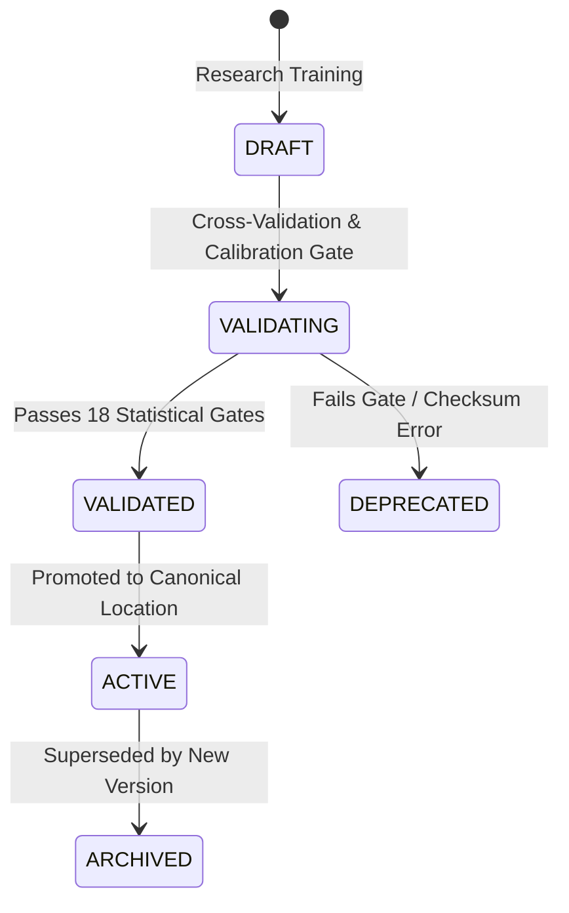

# Model Governance & Production Readiness Lifecycle (docs/MODEL_GOVERNANCE.md)

## 1. Lifecycle State Machine
Model artifacts transition strictly through four lifecycle states:

## 2. 18 Programmatic Production Scorecard Criteria
To achieve `PRODUCTION_READY`, an active artifact must satisfy all 18 criteria evaluated in `ProductionScorecardService`:
1. `DATA_INTEGRITY`: Non-negative prices, valid high/low bounds, chronological order.
2. `POINT_IN_TIME_CORRECTNESS`: Feature truncation at entry timestamp with zero future lookahead.
3. `SURVIVORSHIP_BIAS_CONTROL`: Documented status `NOT_FULLY_RESOLVED` and trailing liquidity pool.
4. `LOOKAHEAD_BIAS_CONTROL`: Chronological partition ordering: Train $\le$ Val $\le$ Test $\le$ Holdout.
5. `WALK_FORWARD_VALIDITY`: Rolling walk-forward cross-validation verified.
6. `MODEL_REPRODUCIBILITY`: Deterministic canonical SHA-256 serialization.
7. `PROBABILITY_CALIBRATION`: Monotonic PAV isotonic calibration on validation data.
8. `EXPECTED_RETURN_VALIDITY`: Empirical return quantiles (85th Bull, 50th Base, 15th Bear).
9. `BACKTEST_VALIDITY`: Daily equity curve statistics computed post-friction.
10. `COST_MODELING`: Centralized 0.13% round-trip friction and conservative same-candle priority.
11. `RISK_MODEL`: Multi-factor downside deviation, ATR volatility, gap risk, and tail risk.
12. `PORTFOLIO_RISK`: Risk Guardian concentration limits and idempotent sell signals.
13. `ARTIFACT_INTEGRITY`: Canonical single-file storage with matching SHA-256 hash.
14. `MODEL_VERSIONING`: Semantic versioning compatibility (v5.0.0).
15. `EXPLAINABILITY`: Structured technical evidence, regime rationale, and invalidation conditions.
16. `TEST_COVERAGE`: 100% test pass rate across invariant and adversarial test suites.
17. `PRODUCTION_INFERENCE`: Runtime inference executes verified ONNX graphs.
18. `FAIL_SAFE_BEHAVIOR`: Fail-closed fallback to diffusion defaults without claiming false precision.
