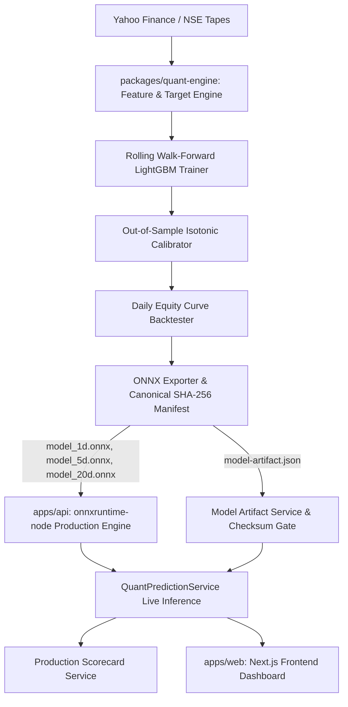

# QuantX Quantitative System Architecture (docs/QUANT_ARCHITECTURE.md)

## 1. System Overview
QuantX employs a dual-tier quantitative architecture separating statistical research and model fitting from live low-latency production execution:
- **Research & Training Tier (Python LightGBM)**: Located in `packages/quant-engine/`. Ingests 5-year daily OHLCV data across Indian equities, extracts 25 point-in-time features, formulates net-return directional targets, trains 3 horizon models (1d, 5d, 20d) via rolling walk-forward cross-validation, fits out-of-sample Isotonic calibrations, runs daily portfolio equity curve simulations, and exports immutable ONNX graphs.
- **Production Inference & Governance Tier (NestJS onnxruntime-node)**: Located in `apps/api/`. Loads immutable canonical artifacts, verifies recursive SHA-256 checksums, evaluates live multi-factor features natively through `onnxruntime-node`, applies calibrated lookup tables, estimates empirical return quantiles (85th Bull, 50th Base, 15th Bear), and enforces fail-closed production gates.
- **User Interface Tier (Next.js)**: Located in `apps/web/`. Renders live prediction cards, backtest curves, and governance dashboards with zero fake fallback numbers (`N/A` or `DATA UNAVAILABLE` when unpopulated).

## 2. Invariant Commitments
1. **Zero Dual-Heuristic Drift**: Production inference executes the trained LightGBM ONNX model.
2. **Zero In-Sample Data Reuse**: Calibration is fitted strictly on validation partitions and tested out-of-sample.
3. **Deterministic Canonical Hashing**: Manifests are hashed with recursive key-sorted canonical JSON.
4. **Friction-Adjusted Targets**: Targets are defined as $P(\text{forward net return} > 0)$ after deducting 0.13% round-trip institutional friction.
