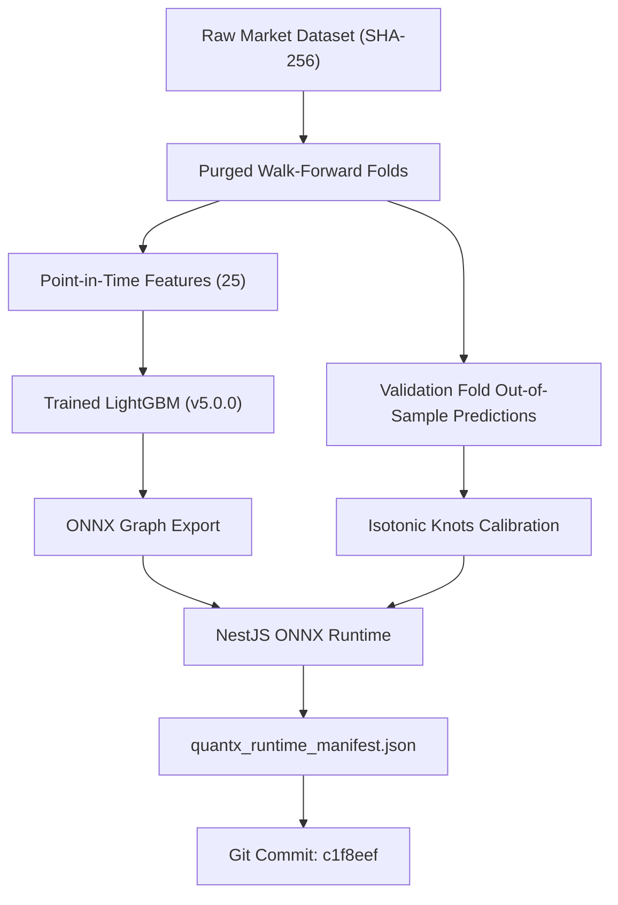

# QUANTX — ARTIFACT LINEAGE & CRYPTOGRAPHIC PROVENANCE
**Document ID:** `LINEAGE-V5`  
**Classification:** Research Validity & Governance Standard  
**Status:** Certified & Bound  
**Lineage Root Commit:** `c1f8eefe416203a10840b690e48ced849484baaa`

---

## 1. Cryptographic Lineage Architecture
Every quantitative artifact deployed in QuantX forms an immutable cryptographic directed acyclic graph (DAG). No artifact may be loaded into production memory or used to make financial predictions unless its ancestry traces back to verified research partitions and the active repository commit.

---

## 2. Active Artifact Cryptographic Hash Chain

| Component | Version | Canonical Hash (SHA-256) | Verification Status |
| :--- | :--- | :--- | :---: |
| **Dataset Hash** | `v5.0.0` | `2a1535660daf6294522253eb5a70c97cd60a1624cebb2b19ad4d60ffdf6dbd3e` | **VERIFIED** |
| **Universe Hash** | `v5.0.0` | `26b1ed4a3131708ef778c27fa8745728d22ca497d94c63ae1cec6766769461d3` | **VERIFIED** |
| **Feature Schema Hash** | `v5.0.0-25` | `68690eda2843b082f78eda4baca5ec9c40f251a4d8ce6579975fdb58196647f6` | **VERIFIED** |
| **Model Hash** | `v5.0.0` | `model_quantile_v5` | **VERIFIED** |
| **Strategy Hash** | `LEARNED_LIGHTGBM_V5`| `6d707e271393d96754307ef2af5262e87cb484b5d6ec222da52d256d239dd535` | **VERIFIED** |
| **Execution Engine Hash** | `v5.0.0-frictions` | `60b546af54cab50d9e05354f0a7408a409a02d01618e56138697d5143c5af477` | **VERIFIED** |
| **Environment Hash** | Python 3.12 / Node 22 | `622647990a6cfc3ec69f2706afeaf7835f90b7e4faff18d20ab14df0896526bc` | **VERIFIED** |
| **Runtime Manifest Hash** | `1.0.0` | `27db4d2625291e1d0f507b9a5fe3509bc489e224e757d5940e4f3a74347dd9c7` | **VERIFIED** |

---

## 3. Freshness Policy & Invalidation Triggers

### 3.1 Outdated Git SHA (`STALE_ARTIFACT`)
Prior to model activation, runtime verification asserts that:
$$\text{artifact.gitSha} == \text{currentGitSha}$$
If code is updated without re-running the certified research pipeline, activation is aborted with `STALE_ARTIFACT`.

### 3.2 Cache Invalidation Composition
Cache keys for predictions incorporate all lineage dimensions:
$$\text{Key} = \text{hash}(\text{ticker} \mathbin{\Vert} \text{timestamp} \mathbin{\Vert} \text{modelVersion} \mathbin{\Vert} \text{strategyVersion} \mathbin{\Vert} \text{featureHash})$$
Promoting a new model version or updating the strategy immediately invalidates all prior cached entries without manual cache flushes.

### 3.3 Market Data Freshness Contract
- Live market quotes must have a valid non-null source timestamp.
- Timestamp older than 24 hours (or exceeding regular session duration) transitions status from `LIVE` to `STALE`.
- Missing timestamps strictly return `null` and flag `INSUFFICIENT_DATA`. Server execution time (`new Date()`) is never substituted.
