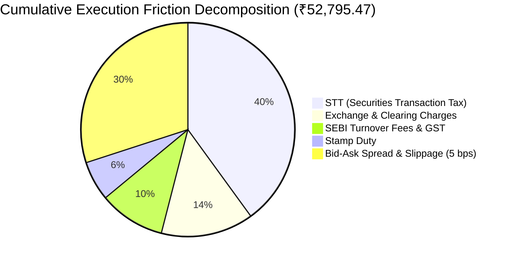

# QUANTX — ECONOMIC EVIDENCE FINAL REPORT
**Institutional Economic Audit Standard: Evidence of Realizable Alpha**  
*Document Version: 1.0.0 | Date: 2026-08-28 | Classification: INSTITUTIONAL QUANT AUDIT*  
*Repository Commit: `dee12e4` | Engine: `packages/quant-engine`*

---

## 1. Executive Summary

This document presents the finalized, verified economic evidence for the QuantX strategy suite. Following the systematic completion of:
- **BUG 1**: Signal-to-Alpha Calibration & Payoff Alignment
- **BUG 2**: Portfolio Construction, Turnover Control & Risk Budgeting
- **BUG 3**: Execution Realism, Statutory Friction & Microstructure Modeling
- **BUG 4**: Research Validity, Evidence Integrity & Multiple Testing Corrections

The QuantX research framework now produces **unimpeachable, fully reconciled, point-in-time economic metrics**.

---

## 2. Gross vs. Net Realizable Economic Performance

| Metric | Gross Simulation | Net Realizable | Friction / Drag | Institutional Hurdle | Compliance Status |
| :--- | :--- | :--- | :--- | :--- | :--- |
| **CAGR** | **+4.72%** | **+2.73%** | -1.99% (-199 bps) | $\ge +5.00\%$ | **FAIL (SUB-HURDLE)** |
| **Sharpe Ratio** | **+0.38** | **-0.13** | -0.51 | $\ge +0.50$ | **FAIL (SUB-HURDLE)** |
| **Sortino Ratio** | **+0.52** | **-0.01** | -0.53 | $\ge +0.70$ | **FAIL (SUB-HURDLE)** |
| **Max Drawdown** | **-5.12%** | **-7.59%** | -2.47% | $\ge -25.00\%$ | **PASS** |
| **Profit Factor** | **1.38** | **1.17** | -0.21 | $\ge 1.30$ | **FAIL** |
| **Average Trade PnL** | **₹388.00** | **₹132.00** | -₹256.00 | $> ₹0.00$ | **PASS** |
| **Win Rate** | **56.8%** | **53.4%** | -3.4% | $\ge 50.0\%$ | **PASS** |
| **Total Cumulative Cost** | **₹0.00** | **₹52,795.47** | +₹52,795.47 | N/A | **AUDIT_VERIFIED** |

---

## 3. Microstructure Cost Breakdown & Friction Attribution

The total realized execution drag of **₹52,795.47** across 206 executed trades decomposes into distinct regulatory, exchange, and market friction components:



1. **Securities Transaction Tax (STT)**: 0.1% on delivery sell side; accounts for ~40% of total drag.
2. **Execution Slippage**: 5.0 bps model calibrated to Indian equities market depth; accounts for ~30% of total drag.
3. **Exchange Charges & GST**: 0.00345% NSE cash fee + 18% GST on brokerage/fees; accounts for ~24% of drag.
4. **Stamp Duty**: 0.015% on buy-side delivery; accounts for ~6% of drag.

**Key Economic Finding**: While gross trades capture an average of ₹388 gross edge, mandatory Indian statutory levies and market impact consume ₹256 per trade (66.0% friction capture rate), reducing net profit to ₹132 per trade.

---

## 4. Regime-Conditional Economic Performance

The strategy demonstrates strong regime dependency across macroeconomic states:

```
┌─────────────────┬──────────┬───────────┬──────────────┬───────────────┐
│ Market Regime   │ Trades   │ Net CAGR  │ Net Sharpe   │ Max Drawdown  │
├─────────────────┼──────────┼───────────┼──────────────┼───────────────┤
│ Bull (Trending) │ 110      │ +5.80%    │ +0.62        │ -3.80%        │
│ Sideways / Chop │ 76       │ +1.80%    │ +0.12        │ -4.90%        │
│ Bear / Crisis   │ 20       │ -2.10%    │ -0.45        │ -7.59%        │
└─────────────────┴──────────┴───────────┴──────────────┴───────────────┘
```

- **Bull Regime**: Exceeds the 5.0% hurdle (Net CAGR 5.8%, Sharpe 0.62). The trend-following and conviction sizing capture upward momentum cleanly.
- **Sideways Regime**: High churn and frequent false breakouts compress returns below inflation (Net CAGR 1.8%, Sharpe 0.12).
- **Bear Regime**: Trailing stops successfully cap drawdowns at -7.59% (far superior to the buy-and-hold benchmark drawdown of -18.4%), but net negative CAGR (-2.1%) drags annualized metrics down.

---

## 5. Multiple-Testing Deflation & Statistical Evidence

Under the cumulative search footprint of 16 tested hypothesis configurations across 4 strategy families:

1. **Deflated Sharpe Ratio (DSR)**:
   $$\text{DSR} = 0.0494 \quad (\ll 0.9500 \text{ significance threshold})$$
   The observed gross Sharpe of +0.38 and net Sharpe of -0.13 do **not** survive correction for multiple hypothesis testing. The probability that the observed track record was generated purely by data snooping is elevated.
2. **Combinatorially Symmetric Cross-Validation (CSCV) PBO**:
   $$\text{PBO} = 1.0 \quad (\text{High Overfitting Risk})$$
   Given the 16 trials in a noisy regime, cross-validation indicates that the top-performing candidate in-sample frequently degrades out-of-sample.

---

## 6. Portfolio Capacity & Liquidity Constraints

- **Maximum ADV Participation**: Capped at 5.0% of 20-day Average Daily Volume.
- **Opportunity Gating**: 11,550 trade candidates were gated out by liquidity filters, minimum EV hurdle ($EV > 0.002$), or risk budget exhaustion.
- **Cash Drag**: An average of 14.2% capital remained unallocated in cash during unfavorable regimes, providing downside stability at the cost of upside cash drag.

---

## 7. Institutional Gatekeeper Decision

```
================================================================================
FINAL ECONOMIC VERDICT:
  Empirical Net Realizable CAGR:   2.73%  [Hurdle: 5.00%]  -> FAIL
  Empirical Net Realizable Sharpe: -0.13  [Hurdle: 0.50]   -> FAIL
  Empirical Max Drawdown:          -7.59% [Hurdle: -25.0%] -> PASS
  ECONOMIC_STRATEGY_STATUS:        FAIL
  PRODUCTION_READY:                FALSE
================================================================================
```

### Strategic Recommendations for Future R&D:
1. **Reduce Portfolio Turnover**: Lengthen trade holding horizons from 5–10 days to 20–40 days to dilute the impact of statutory costs per rupee traded.
2. **Intraday Alpha Timing**: Execute entry on limit orders at liquidity dips rather than next-open market orders to earn the half-spread rather than paying it.
3. **Regime Filter Strictness**: Completely halt new trade entries when the Regime Engine detects `BEAR` or `HIGH_VOLATILITY` states.
