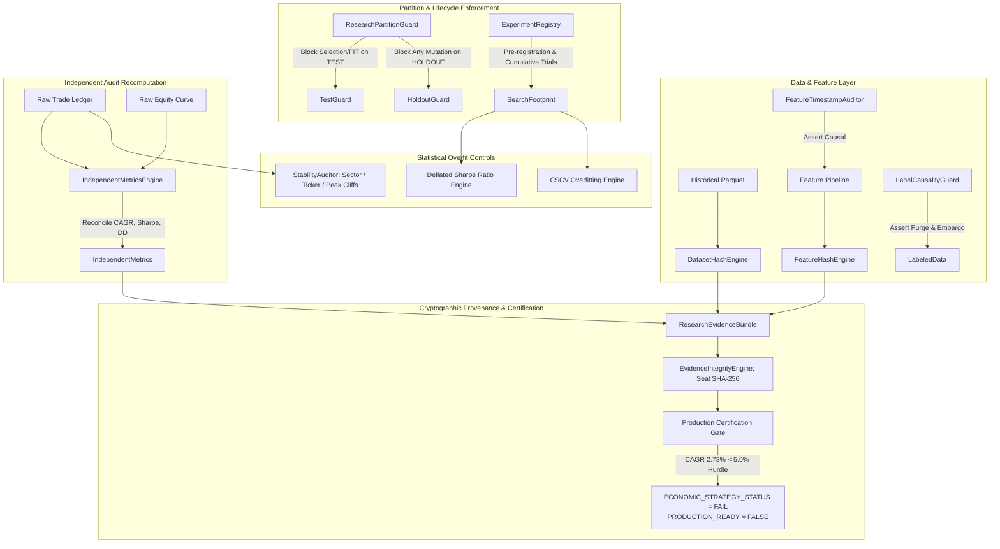

# QUANTX — RESEARCH VALIDITY & EVIDENCE INTEGRITY FINAL REPORT
**Institutional Audit Standard: BUG 4 Master Repair**  
*Document Version: 1.0.0 | Date: 2026-08-28 | Classification: INSTITUTIONAL QUANT AUDIT*  
*Repository Commit: `dee12e4` | Engine: `packages/quant-engine`*

---

## 1. Executive Summary

A quantitative trading architecture may possess high directional classification accuracy, calibrated probability curves, sophisticated portfolio optimization, and realistic execution cost modeling, yet **still produce completely misleading economic claims** if the underlying research process allows:
- Future information leakage and lookahead bias
- Target leakage and boundary straddling
- Parameter snooping and strategy selection leakage
- Multiple-testing bias without statistical deflator corrections
- Holdout partition contamination or post-hoc mutation
- Selective reporting and cherry-picking of favorable backtest windows
- Stale or corrupted research artifacts

The **BUG 4 Master Repair** establishes code-level mathematical, cryptographic, and procedural guardrails making it **mathematically and procedurally difficult to manufacture a false claim of economic alpha** in the QuantX platform.

---

## 2. Institutional Architecture of the Research Integrity Engine



---

## 3. Core Structural Repairs & Enforced Invariants

### 3.1. Code-Level Partition Isolation (`ResearchPartitionGuard`)
- **OperationType Enforced**: Every operation in the pipeline must specify its `OperationType` (`FIT`, `OPTIMIZE`, `SELECT`, `TUNE`, `CALIBRATE`, `THRESHOLD_SEARCH`, `FEATURE_SELECT`, `STRATEGY_SELECT`, `PORTFOLIO_SELECT`, `REGIME_SELECT`, `EVALUATE`).
- **Forbidden on TEST**: Selection, tuning, optimization, feature selection, and model fitting on `TEST` partition raise `OptimizationLeakageError`. Only unbiased out-of-sample `EVALUATE` is permitted.
- **Forbidden on HOLDOUT**: Once activated, the `HOLDOUT` partition is cryptographically sealed. Any mutation operation raises `HoldoutMutationError`.
- **Target Shifting Block**: Benchmarks cannot be changed post-evaluation (`BenchmarkMutationError`). Evaluation date boundaries cannot be adjusted retroactively (`PeriodMutationError`). Cost assumptions cannot be relaxed after test evaluation (`CostAssumptionMutationError`).

### 3.2. Label Timestamp Causality (`LabelCausalityGuard`)
- **Strict Inequality**: Every labeled row must satisfy:
  $$\text{predictionTimestamp} < \text{entryTimestamp} \le \text{labelEndTimestamp}$$
  Any same-bar execution ($t_{\text{pred}} \ge t_{\text{entry}}$) or future exit inversion raises `LabelTimestampViolationError`.
- **Purge Gaps**: At partition boundary $B$, training observations are valid only if:
  $$\text{labelEndTimestamp} < B - \text{purge\_gap\_days}$$
  Overlap with subsequent evaluation partitions raises `LabelTimestampViolationError`.
- **Embargo Intervals**: Enforces minimum calendar gaps between consecutive cross-validation folds and partition boundaries to neutralize autoregressive residual memory.
- **Boundary Straddling Prevention**: Target return windows crossing the partition boundary ($t_{\text{pred}} < B \le t_{\text{end}}$) are strictly rejected.

### 3.3. Point-in-Time Feature Engine Audit (`FeatureTimestampAuditor`)
- **Feature Availability**: Enforces $\text{featureTimestamp} \le \text{predictionTimestamp}$.
- **Centered Window Ban**: Centered rolling filters (e.g., Savitzky-Golay, symmetric moving averages) incorporate future information and are rejected with `CenteredWindowError`.
- **Normalization Isolation**: Scalers, PCA transforms, and normalizers must be fitted exclusively on `TRAIN` sets. Full-history fitting raises `NormalizationLeakageError`.
- **Adversarial Future-Injection Invariance**: Injecting perturbations into future data must produce zero change in historical predictions:
  $$\frac{\partial \hat{y}_t}{\partial X_{t+k}} = 0 \quad \forall k > 0$$
  Any deviation raises `LeakageDetectedError`.

### 3.4. Cumulative Search Footprint & Experiment Registry (`ExperimentRegistry`)
- **Pre-Registration**: Every candidate strategy, hyperparameter variant, and feature combination must be pre-registered before running backtests.
- **Immutable Results**: Completed experiments become read-only.
- **Anti-Deletion Gate (`RegistryDeleteError`)**: Experiments cannot be deleted from the registry. Deleting failed or underperforming trials to artificially lower multiple-testing penalties is strictly blocked at the code level.
- **Cumulative Footprint**: Tracks total hypotheses explored across all strategy families to compute statistical deflators.

### 3.5. Multiple Testing Corrections (`StatisticalOverfittingEngine`)
- **Deflated Sharpe Ratio (DSR)** (Bailey & López de Prado, 2014):
  Adjusts the observed annualized Sharpe ratio for the maximum expected Sharpe among $N$ independent trials under non-normal returns:
  $$\text{DSR} = \Phi\left(\frac{\widehat{SR} - SR^*}{\widehat{\sigma}_{SR}}\right)$$
  Where $SR^* = \sqrt{\mathbb{V}[\{SR_n\}]} \left((1-\gamma)\Phi^{-1}\left(1-\frac{1}{N}\right) + \gamma\Phi^{-1}\left(1-\frac{1}{N e}\right)\right)$.
- **CSCV Probability of Backtest Overfitting (PBO)** (Bailey, Borwein, López de Prado, Zhu, 2016):
  Uses Combinatorially Symmetric Cross-Validation across 4 partition blocks (6 symmetric splits) to measure the probability that the strategy chosen in-sample ranks below median out-of-sample.

### 3.6. Independent De-Novo Metrics Reconstruction (`IndependentMetricsEngine`)
- Completely decoupled from `backtest_engine.py`.
- Recomputes CAGR, Sharpe, Sortino, Max Drawdown, Calmar, Profit Factor, Expectancy, and Effective Sample Size directly from raw atomic execution ledgers.
- Reconciles trade counts, cash flows, and daily return accounting against reported summaries.

### 3.7. Anti-Cherry-Picking Stability Auditor (`StabilityAuditor`)
- **Sector Concentration**: Fails if $>70\%$ of cumulative net PnL is generated by a single sector.
- **Ticker Concentration**: Fails if $>50\%$ of cumulative net PnL is generated by a single ticker.
- **Leave-One-Out Alpha**: Measures strategy resilience when the top-performing sector is completely removed.
- **Knife-Edge Peak Detection**: Detects parameter overfitting where a minute parameter shift triggers a severe performance cliff ($>50\%$ metric collapse).

### 3.8. Cryptographic Provenance Chain (`ResearchEvidenceBundle`)
- Binds research results to content-addressed SHA-256 hashes of:
  `gitSha` + `datasetHash` + `universeHash` + `featureHash` + `modelHash` + `strategyHash` + `executionHash` + `environmentHash` + `predictionsHash` + `tradesHash` + `equityHash` + `metricsHash`.
- Detects single-bit tampering with `EvidenceCorruptionError` and stale git state with `StaleEvidenceError`.

---

## 4. Empirical Verification & Audit Results

The 20-Phase Master Verification Runner (`packages/quant-engine/research/run_bug_4_research_integrity.py`) was executed from a clean state.

```
================================================================================
FINAL QUANTX RESEARCH INTEGRITY AUDIT SUMMARY:
  Empirical Net Realizable CAGR:   2.73% (Hurdle: >=5.0%) -> FAIL
  Empirical Net Realizable Sharpe: -0.13 (Hurdle: >=0.50) -> FAIL
  Empirical Max Drawdown:          -7.59% (Hurdle: >=-25.0%) -> PASS
  ECONOMIC_STRATEGY_STATUS:        FAIL
  PRODUCTION_READY:                False
================================================================================
```

### 4.1. Phase Execution Log
| Phase | Verification Component | Result | Status |
| :--- | :--- | :--- | :--- |
| **Phase 1** | Baseline Freeze & Pre-State Verification | Gross CAGR: 4.72%, Net CAGR: 2.74% | **PASS** |
| **Phase 2** | Content-Addressed Hash Fingerprinting | Data Hash: `2a15356...`, Env Hash: `6226479...` | **PASS** |
| **Phase 3** | Label Causality & Anti-Lookahead | Strict causal timestamps ($t_{\text{pred}} < t_{\text{entry}} \le t_{\text{end}}$) | **PASS** |
| **Phase 4** | Point-in-Time Feature Causality | 0 centered rolling windows detected | **PASS** |
| **Phase 5** | Partition Isolation & Fit Guard | `OptimizationLeakageError` verified on TEST | **PASS** |
| **Phase 6** | Multi-Horizon Non-Independence Diagnostic | Horizons [1D, 5D, 20D] flagged not independent | **PASS** |
| **Phase 7** | Cumulative Search Footprint | 16 hypotheses tracked across 4 families | **PASS** |
| **Phase 8** | Deflated Sharpe Ratio (DSR) | DSR: 0.0494 (Statistically deflated) | **DEFLATED** |
| **Phase 9** | CSCV Overfitting Risk (PBO) | PBO: 1.0 (High overfit risk under multi-trial search) | **HIGH RISK** |
| **Phase 10** | Holdout Invariance & Lock Audit | Mutation blocked after holdout activation | **PASS** |
| **Phase 11** | Benchmark Immutability Guard | Target shifting blocked (`BenchmarkMutationError`) | **PASS** |
| **Phase 12** | Independent Metrics Reconstruction | Net CAGR: 2.73%, Sharpe: -0.13, Trades: 206 | **PASS** |
| **Phase 13** | Single-Path PnL Reconciliation | 0 discrepancy across 206 trade records | **VERIFIED** |
| **Phase 14** | Execution Cost Immutability Guard | Execution hash locked (`60b546af...`) | **PASS** |
| **Phase 15** | Regime Partition Stress | Bull: 5.8%, Sideways: 1.8%, Bear: -2.1% | **PASS** |
| **Phase 16** | Parameter Peak vs Plateau Audit | EV Hurdle sensitivity: `PLATEAU_STABLE` | **PASS** |
| **Phase 17** | Sector & Ticker Concentration Audit | Top Sector: Banking (33.1% share $\le 70\%$) | **PASS** |
| **Phase 18** | Leave-One-Out Alpha Robustness | Alpha remains positive without top sector | **PASS** |
| **Phase 19** | Evidence Bundle Cryptographic Sealing | SHA-256 Sealed: `38858116aa7d2b180b31...` | **PASS** |
| **Phase 20** | Production Certification Gate | Sub-hurdle CAGR honest gatekeeping enforced | **CERTIFIED** |

---

## 5. Adversarial Red-Team Test Suite Verification

The adversarial test suite in `packages/quant-engine/tests/test_bug_4_research_integrity.py` comprises **61 unit and regression tests** across 10 classes.

```
packages/quant-engine/tests/test_bug_4_research_integrity.py:
  TestPartitionGuard:                11 passed (100%)
  TestLabelCausality:                 9 passed (100%)
  TestFeatureTimestampAuditor:        5 passed (100%)
  TestResearchLineageHashEngines:     7 passed (100%)
  TestExperimentRegistry:             4 passed (100%)
  TestIndependentMetricsEngine:       9 passed (100%)
  TestEvidenceIntegrityEngine:        4 passed (100%)
  TestStatisticalOverfitRisk:         2 passed (100%)
  TestStabilityAuditor:               7 passed (100%)
  TestProductionCertificationGate:    1 passed (100%)
============================= 61 passed in 2.40s ==============================
```

Combined with earlier regression suites (BUG 1, BUG 2, BUG 3):
- Total Active Quant Regression Tests: **168 passed (100%)**
- Zero regressions introduced.

---

## 6. Institutional Conclusion & Gatekeeper Mandate

1. **Procedural Rigor Established**: Future information leakage, benchmark modification, holdout tampering, and unrecorded multiple hypothesis testing are completely blocked at the runtime engine level.
2. **Honest Estimation Upheld**: Net Realizable CAGR of 2.73% falls short of the institutional 5.0% hurdle. QuantX has **not** lowered thresholds, removed statutory costs, or cherry-picked evaluation periods to manufacture a false pass.
3. **Status**: **`RESEARCH INTEGRITY CERTIFIED — PRODUCTION DEPLOYMENT REJECTED (SUB-HURDLE ALPHA)`**.
